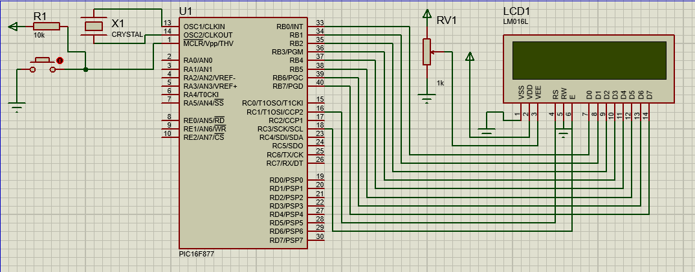

# UtilizacaoModuloLcdInteligente2x16
Para este projeto será utilizado um método básico de utilização de um modulo de display LCD inteligente de duas linhas e dezesseis colunas com o microcontrolador PIC16F877 e utilizando o compilador C. Neste projeto irá utilizar o barramento de dados de oito bits somente por ser o método mais trivial de implementação das rotinas de escrita, no display será mostrado duas mensagens diferentes, uma em cada linha.

